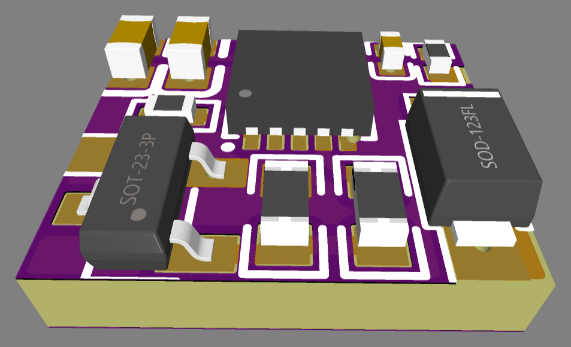
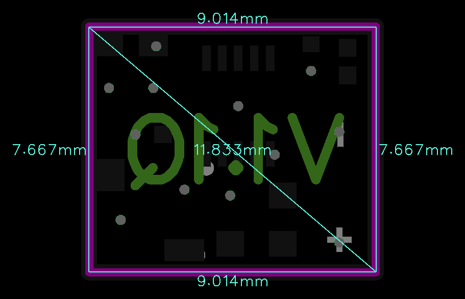

# 5VIN_ADC_v1.1Q

> Ultra-compact cyclic power reboot and emergency shutdown module with inductive load protection and soft-start.

  
  

---

### ⚡ Electrical Specifications & Power Features

* **〰️ Operating Current**:
  * **5.0 V Supply**: Up to **6 A**
  * **3.3 V Supply**: Up to **4 A**
* **🛡️ Inrush Current Protection**:
  * **Soft Start (20 ms)**
* **🧲 Inductive Load Protection**:
  * Integrated flyback diode clamping (up to 50 A peak) for relays, solenoids, and motors.
* **📏 Form Factor**:
  * Sub-miniature footprint measuring **`9.0 × 7.7 mm`**.

---

### ⚙️ Operating Logic & `LED` Pin

* **⏱️ Cyclic Reboot Every 10 Hours**
* **🎛️ Event-Driven Control (`LED` Pin)**
