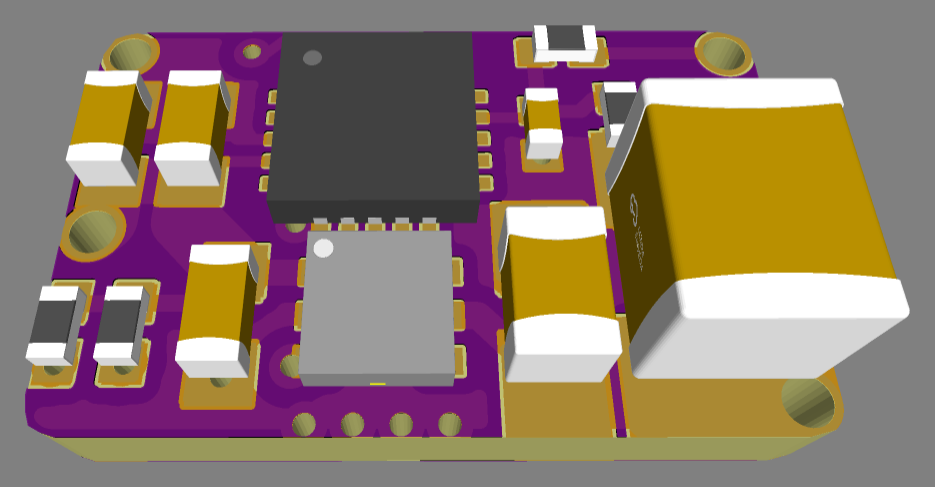
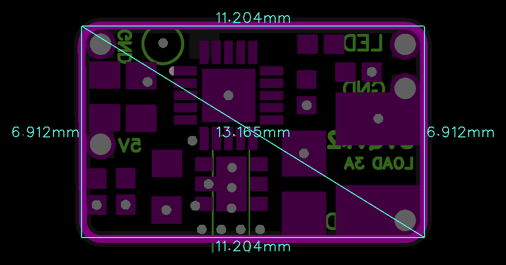

# 5VIN_ADC_v1.2Q

> Ultra-compact USB Power Control & Protection Board with automated cyclic reboot and comprehensive hardware protection.

  
  

---

### ⚡ Electrical Specifications & Protection Features

* **〰️ Maximum Continuous Load Current**:
  * **Up to 3.0 A** continuous output (3.3 V / 5.0 V).
* **🔀 Power Management**:
  * **Soft Start (3 ms)**
  * **Active Output Discharge (90 Ω)**
* **🛡️ Integrated Hardware Protections**:
  * **Over-Current Protection (OCP)** with Auto-Recovery.
  * **Fast Short-Circuit Protection (SCP)**.
  * **Reverse Current Blocking & UVLO**.
  * **Thermal Shutdown Protection**.
* **📏 Form Factor**:
  * Ultra-compact footprint measuring **`11.2 × 6.9 mm`**.

---

### ⚙️ Operating Logic & `LED` Pin

* **⏱️ Cyclic Reboot Every 10 Hours**
* **🎛️ Event-Driven Control (`LED` Pin)**
