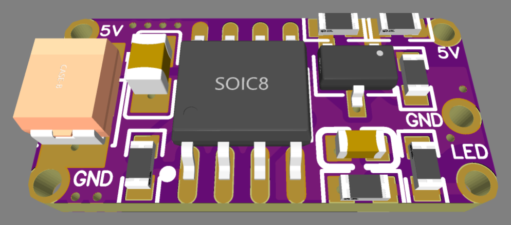
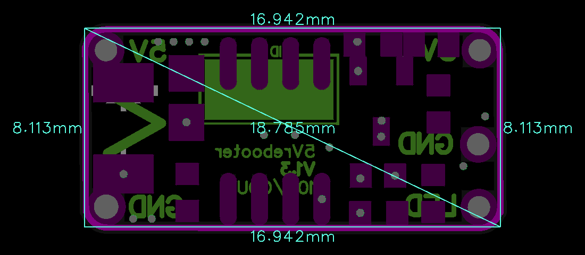

# 5VIN_ADC_v1.3

> 5V cyclic power reboot and emergency shutdown module with high-side switching and soft-start inrush protection.

  
  

---

### ⚡ Electrical Specifications & Power Features

* **🔋 Operating Voltage (`VIN`)**:
  * **5.0 VDC** *(3.3 V supply is not supported)*.
* **〰️ Maximum Continuous Current**:
  * Up to **3.5 A**.
* **🔀 Switch Architecture**:
  * High-side switching with continuous common ground plane.
* **🛡️ Inrush Current Protection**:
  * **Soft Start (20 ms)**
* **📏 Form Factor**:
  * Compact footprint measuring **`16.9 × 8.1 mm`**.

---

### ⚙️ Operating Logic & `LED` Pin

* **⏱️ Cyclic Reboot Every 10 Hours**
* **🎛️ Event-Driven Control (`LED` Pin)**
