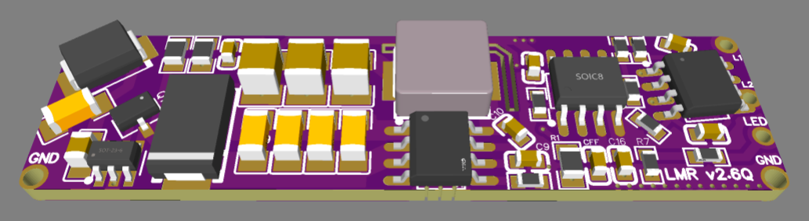
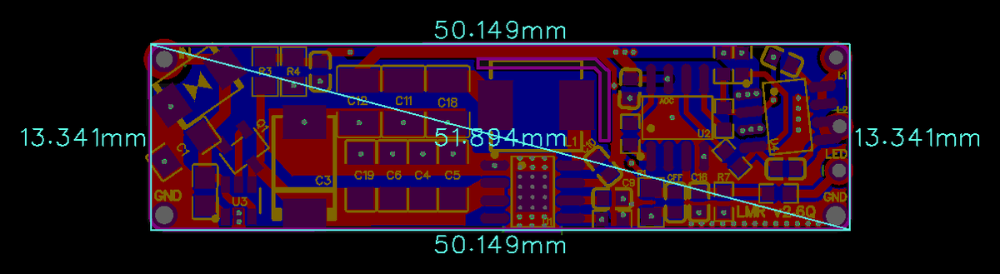

# LMR_v2.6Q

> Automotive-Grade (AEC-Q100) 12V to 5V/3A Power Step-Down & Cyclic Reboot Module with Smart Battery Discharge Protection (ECO Mode), Dual Load Outputs (L1/L2), and -65V Reverse Voltage Clamping.

  
  

---

### ⚡ Electrical Specifications & Power Conversion

* **🔋 Input Voltage Range (`VIN`)**:
  * **Operating Window**: **4.0 VDC to 30.0 VDC** (automotive 12V network nominal).
  * **Minimum Cold-Start Voltage**: **5.15 VDC**.
* **⚡ Regulated DC Output**:
  * **Output Voltage**: Stabilized **5.0 VDC**.
  * **Dual Switched Channels (`L1` & `L2`)**: Multi-channel load routing.
* **〰️ Continuous Operating Current**:
  * Up to **3.0 A** continuous load current.
* **🛡️ Over-Current & Short-Circuit Protection**:
  * Current limit trip point (~3.5 A) and instant SCP cutoff.
* **📏 Form Factor**:
  * Compact footprint measuring **`50.1 × 13.3 mm`**.

---

### 🚗 Automotive-Grade Protection Architecture (AEC-Q100)

* **🛡️ Reverse Polarity Protection**:
  * Integrated reverse-blocking protection up to **-65 VDC**.
* **⚡ Transient Surge Suppression**:
  * **600 W Peak Pulse Power** clamping inductive spikes and load dumps.
* **🌡️ Thermal Protection (OTP)**:
  * Over-temperature cutoff at **160 °C** with auto-recovery hysteresis.

---

### 🔋 Smart Battery Guard & ECO Mode Logic

* **🔋 Low-Voltage Battery Guard**:
  * Low-voltage disconnect threshold set to **~12.1 VDC**.
* **🌱 Ultra-Low-Power ECO Mode**:
  * Quiescent current drops to **< 1 mA** to prevent battery depletion.
* **🔄 Hysteresis Auto-Recovery**:
  * Automatically reconnects when supply voltage recovers to **~13.1 VDC**.
* **⏱️ Initial Cold-Boot Window**:
  * 10-minute courtesy operating period when connected to discharged battery.

---

### ⚙️ Operating Logic & `LED` Pin

* **⏱️ Cyclic Reboot Every 10 Hours**
* **🎛️ Event-Driven Control (`LED` Pin)**

---

### 📌 Hardware Pinout

#### Power Input Pads (Left Side)
| Pad | Function | Direction | Description |
| :--- | :--- | :---: | :--- |
| **`IN / +12V`** | **Power Input** | **Input** | Main vehicle battery input (**4.0 – 30.0 VDC**, nominal 12V). |
| **`GND`** | **Power Ground** | **Power** | System battery negative / ground return. |

#### Output & Control Header (Right Side, 4-Pin)
| Pin | Name | Type | Description |
| :---: | :--- | :---: | :--- |
| **1** | **`L1`** | **Output** | Switched +5.0 VDC Output Channel 1 (primary load). |
| **2** | **`L2`** | **Output** | Switched +5.0 VDC Output Channel 2 (secondary / dual load). |
| **3** | **`LED`** | **Input** | External monitoring/alarm input with wire-break protection. |
| **4** | **`GND`** | **Power** | Common system ground. |
