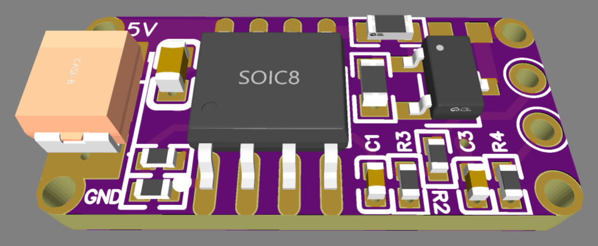
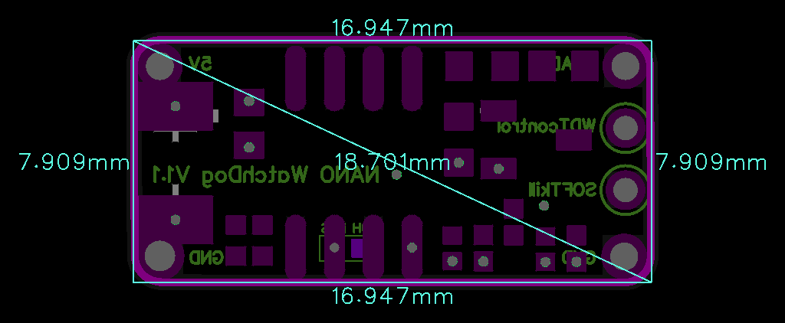

# NanoWDC_v1.1

> Ultra-compact 5V/3.5A High-Side WatchDog & Power Control Board with wdtCONTROL heartbeat monitoring, SOFTkill shutdown, and configurable 10-hour cyclic reboot.

  
  

---

### ⚡ Electrical Specifications & Power Features

* **🔋 Operating Voltage (`VIN`)**:
  * **5.0 VDC** *(3.3 V supply is strictly not supported)*.
* **〰️ Maximum Continuous Load Current**:
  * Up to **3.5 A**.
* **🔀 Switch Architecture**:
  * High-side switching with continuous common ground plane.
* **🛡️ Inrush Current Protection**:
  * **Soft Start (20 ms)**
* **📦 Load Compatibility**:
  * Non-inductive digital loads only (SBCs, modems, routers, cameras).
* **📏 Form Factor**:
  * Ultra-compact footprint measuring **`17.0 × 7.9 mm`**.

---

### 📌 Hardware Pinout

#### Power Input Pads (Left Side)
| Pad | Function | Description |
| :--- | :--- | :--- |
| **`5V`** | **Power Input (+)** | Regulated +5.0 VDC main power supply input rail. |
| **`GND`** | **Power Input (–)** | System common ground. |

#### Output & Control Header (Right Side, 4-Pin)
| Pin | Name | Type | Description |
| :---: | :--- | :---: | :--- |
| **1** | **`VO`** | **Output** | Switched +5.0 VDC output rail to connected load/device (up to 3.5 A). |
| **2** | **`wdtCONTROL`** | **Input** | Active watchdog heartbeat input from host controller. |
| **3** | **`SOFTkill`** | **Input** | Controlled graceful shutdown trigger from host device. |
| **4** | **`GND`** | **Ground** | Uninterrupted common ground connection. |

#### Configuration Jumper (Bottom Layer)
| Jumper | Mode | Default | Function |
| :--- | :---: | :---: | :--- |
| **`10H RES`** | Solder Pad | **Open (Unbridged)** | **Bridged (Soldered)**: Enables periodic cyclic reboot every **10 hours**. **Open (Unsoldered)**: Pure watchdog operation (reboots triggered strictly via `wdtCONTROL` timeout or `SOFTkill`). |

---

### ⚙️ Operating Logic & Watchdog Control

* **🎛️ Watchdog Monitoring (`wdtCONTROL`)**:
  * **Missing Heartbeat Timeout (30 min)**: Automatic hardware power-cycle reset if host stalls.
  * **Stuck Signal Protection (1 min)**: Triggers emergency shutdown if signal remains continuously active.
* **🛑 Host-Initiated Graceful Shutdown (`SOFTkill`)**:
  * Allows host SBC/device to safely conclude file system operations before cut off.
* **⏱️ Configurable 10-Hour Cyclic Reboot (`10H RES`)**:
  * Optional autonomous daily cycling when solder jumper is bridged.